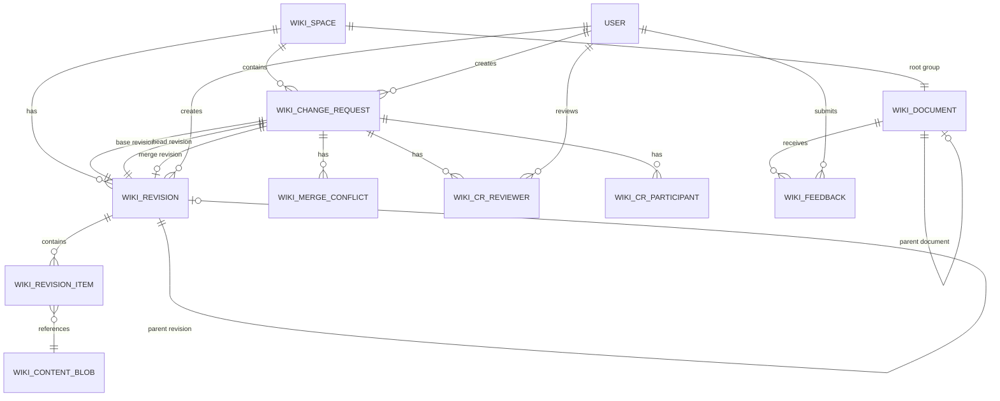

Frappe Wiki uses a sophisticated data model that supports versioning, collaborative editing, and hierarchical document organization.

## Entity Relationship Diagram



## Core Entities

### Wiki Space

**Purpose:** Top-level container for organizing related wiki content.

**Key Fields:**
- `space_name` - Display name
- `route` - URL path (unique)
- `root_group` - Link to root Wiki Document (group)
- `main_revision` - Link to current published Wiki Revision
- `is_published` - Visibility flag
- `show_in_switcher` - App switcher display
- `switcher_order` - Sort order in switcher

**Relationships:**
- Has one root Wiki Document (group/folder)
- Has one main Wiki Revision (current state)
- Has many Change Requests
- Has many navbar items (Top Bar Item)
- Has many sidebar configurations (Wiki Group Item)

**Features:**
- Custom branding (logos, favicon)
- Navbar configuration
- Feedback collection settings

### Wiki Document

**Purpose:** Legacy tree-based document structure (Version 2 compatibility).

**Key Fields:**
- `title` - Display title
- `route` - URL path
- `slug` - URL-friendly identifier
- `doc_key` - Unique internal identifier
- `content` - Markdown content
- `is_group` - Folder vs. page flag
- `is_published` - Public visibility
- `is_private` - Access restriction
- `is_external_link` - External URL redirect
- `external_url` - Target URL for external links

**Tree Structure Fields:**
- `parent_wiki_document` - Parent node
- `lft` - NestedSet left value
- `rgt` - NestedSet right value
- `sort_order` - Manual ordering within parent

**DocType Configuration:**
- Type: Tree DocType (NestedSet)
- Naming: Allow rename
- Title Field: `title`

### Wiki Revision

**Purpose:** Immutable snapshot of the entire document tree at a point in time.

**Key Fields:**
- `wiki_space` - Parent space
- `change_request` - Associated change request (if any)
- `parent_revision` - Previous revision (lineage)
- `message` - Commit message
- `is_merge` - Merge commit flag
- `is_working` - Active working revision flag
- `is_overlay` - Overlay revision flag
- `tree_hash` - Hash of tree structure
- `content_hash` - Hash of all content
- `doc_count` - Number of documents
- `created_by` - Author
- `created_at` - Timestamp

**Relationships:**
- Belongs to Wiki Space
- May belong to Change Request
- Has parent revision (forms revision chain)
- Contains many Revision Items

### Wiki Revision Item

**Purpose:** Individual document state within a revision.

**Key Fields:**
- `revision` - Parent Wiki Revision
- `doc_key` - Document identifier
- `title` - Document title
- `slug` - URL slug
- `route` - Full route path
- `is_group` - Group/folder flag
- `is_published` - Published flag
- `is_external_link` - External link flag
- `external_url` - External URL
- `parent_key` - Parent document key
- `order_index` - Sort order
- `content_blob` - Link to content blob
- `is_deleted` - Deletion marker

**Relationships:**
- Belongs to Wiki Revision
- References Wiki Content Blob
- Parent-child via `parent_key` and `doc_key`

### Wiki Content Blob

**Purpose:** Content-addressable storage for document content.

**Key Fields:**
- `hash` - SHA hash of content (unique)
- `content` - Markdown content (Long Text)
- `content_type` - MIME type (default: markdown)
- `size` - Content size in bytes
- `created_by` - Original author
- `created_at` - Creation timestamp

**Features:**
- Immutable once created
- Automatic deduplication via hash
- Enables efficient diff and merge operations

### Wiki Change Request

**Purpose:** Collaborative review workflow for document changes.

**Key Fields:**
- `title` - Change request title
- `description` - Description of changes
- `wiki_space` - Target space
- `status` - Workflow state
- `base_revision` - Starting point
- `head_revision` - Current changes
- `merge_revision` - Result of merge
- `outdated` - Needs rebase flag
- `merged_by` - Merger user
- `merged_at` - Merge timestamp
- `archived_at` - Archive timestamp

**Status Flow:**
```
Draft → Open → In Review → Changes Requested
                    ↓
                Approved → Merged → Archived
```

**Relationships:**
- Belongs to Wiki Space
- References three Wiki Revisions (base, head, merge)
- Has many reviewers (Wiki CR Reviewer)
- Has many participants (Wiki CR Participant)
- May have merge conflicts (Wiki Merge Conflict)

### Wiki Merge Conflict

**Purpose:** Track and resolve conflicts during change request merges.

**Key Fields:**
- `change_request` - Parent change request
- `doc_key` - Conflicting document
- `conflict_type` - Type: content, meta, or tree
- `status` - Open or Resolved
- `base_payload` - Common ancestor state
- `ours_payload` - Main branch state
- `theirs_payload` - Change request state
- `resolution` - Resolution strategy: ours, theirs, or manual
- `resolved_payload` - Final resolved state
- `resolved_by` - User who resolved
- `resolved_at` - Resolution timestamp

**Conflict Types:**
- **content:** Conflicting edits to document content
- **meta:** Conflicting changes to title, slug, etc.
- **tree:** Conflicting moves or reordering

### Wiki Feedback

**Purpose:** Collect user feedback and ratings for wiki pages.

**Key Fields:**
- `wiki_document` - Target document
- `wiki_page` - Legacy reference
- `rating` - Star rating
- `feedback` - Text feedback
- `email_id` - Submitter email (optional)
- `type` - Good, Bad, or Ok
- `status` - Open or Closed

**Permissions:**
- Creatable by All and Guest roles
- Enables anonymous feedback collection

## Data Model Versions

Frappe Wiki has evolved through multiple data model versions:

### Version 2 (Legacy)

- Direct Wiki Document tree structure
- In-place editing with revision history
- Wiki Page, Wiki Page Revision, Wiki Page Patch

### Version 3 (Current)

- Content-addressable blob storage
- Immutable revisions with full snapshots
- Git-like branching and merging
- Separate working and main revisions

**Migration:** The `migrate_to_wiki` DocType handles migration from Version 2 to Version 3.

## Indexing and Search

### SQLite Full-Text Search

Configured in `wiki/hooks.py`:
```python
sqlite_search = [
    "wiki.frappe_wiki.doctype.wiki_document.wiki_sqlite_search.WikiSQLiteSearch"
]
```

**Indexed Fields:**
- Document title
- Document content (Markdown)
- Document route

**Features:**
- Fast in-process search
- No external dependencies
- Automatically updated on document changes

## Permissions Model

### Roles

- **System Manager:** Full access
- **Wiki Manager:** Full wiki management
- **Wiki Approver:** Review and approve changes
- **Wiki User:** Create and edit content
- **Guest/All:** Read published content, submit feedback

### Permission Patterns

**Wiki Document:**
- Read: All roles (filtered by is_published)
- Write: Wiki Manager, Wiki Approver
- Create/Delete: Wiki Manager

**Wiki Change Request:**
- Create: All authenticated users
- Read: Owner and reviewers
- Approve: Wiki Approver
- Merge: Wiki Manager, Wiki Approver

**Wiki Space:**
- Read: All users
- Write: Wiki Manager, Wiki Approver
- Create/Delete: Wiki Manager

## Data Lifecycle

### Document Creation Flow

1. User creates Wiki Document or Change Request
2. Content is hashed and stored in Wiki Content Blob
3. Wiki Revision Item is created with blob reference
4. Wiki Revision is created with revision items
5. For Change Requests: head_revision points to new revision
6. For direct edits: main_revision is updated

### Change Request Merge Flow

1. Reviewer approves Change Request
2. System creates merge revision from head_revision
3. Detects conflicts by comparing base, main, and head
4. If conflicts exist: Creates Wiki Merge Conflict records
5. If no conflicts: Updates main_revision to merge_revision
6. Sets status to Merged, records merged_by and merged_at

### Content Deletion

- **Soft Delete:** Wiki Revision Item marked `is_deleted=1`
- **Hard Delete:** Wiki Document removed from tree
- **Blob Retention:** Content Blobs are never deleted (referenced by history)
