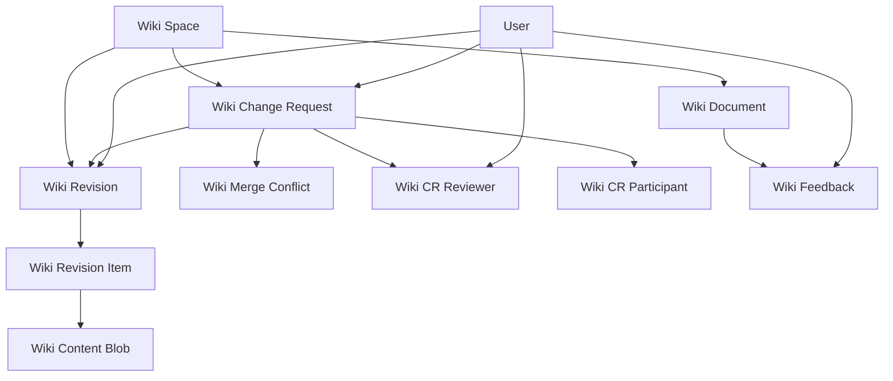

Frappe Wiki uses Frappe Framework's DocType system to define its data schema. All DocTypes are defined in JSON files located in `wiki/**/doctype/**/*.json`.

## Primary DocTypes

### Wiki Space

**Module:** Wiki  
**Path:** `wiki/wiki/doctype/wiki_space/`  
**Naming:** Random (hash)

**Purpose:** Top-level organizational unit for wiki content.

**Fields:**

| Field | Type | Description |
|-------|------|-------------|
| space_name | Data | Display name for the space |
| route | Data | URL path (unique, required) |
| root_group | Link | Root Wiki Document (group only) |
| main_revision | Link | Current published Wiki Revision |
| is_published | Check | Whether space is publicly accessible |
| show_in_switcher | Check | Display in app switcher |
| switcher_order | Int | Sort order in app switcher |
| app_switcher_logo | Attach Image | Logo for app switcher |
| favicon | Attach Image | Space-specific favicon |
| light_mode_logo | Attach Image | Logo for light theme |
| dark_mode_logo | Attach Image | Logo for dark theme |
| enable_feedback_collection | Check | Enable user feedback |
| wiki_sidebars | Table | Sidebar configuration (Wiki Group Item) |
| navbar_items | Table | Navigation items (Top Bar Item) |

**Permissions:**
- System Manager: Full access
- Wiki Manager: Full access
- Wiki Approver: Full access
- Wiki User: Read only

### Wiki Document

**Module:** Frappe Wiki  
**Path:** `wiki/frappe_wiki/doctype/wiki_document/`  
**Naming:** Allow rename  
**Type:** Tree (NestedSet)

**Purpose:** Hierarchical document tree structure (legacy/Version 2).

**Fields:**

| Field | Type | Description |
|-------|------|-------------|
| title | Data | Document title (required) |
| route | Data | URL path |
| slug | Data | URL-friendly identifier |
| doc_key | Data | Unique internal key (read-only, unique) |
| content | Code | Markdown content |
| is_published | Check | Public visibility |
| is_private | Check | Access restricted |
| is_group | Check | Folder vs. page |
| is_external_link | Check | External URL redirect |
| external_url | Data | Target URL (if external link) |
| parent_wiki_document | Link | Parent node in tree |
| lft | Int | NestedSet left value |
| rgt | Int | NestedSet right value |
| sort_order | Int | Manual sort order |
| old_parent | Link | Previous parent (for move tracking) |

**Python Class:** `wiki.frappe_wiki.doctype.wiki_document.wiki_document.WikiDocument`

**Base Class:** `frappe.utils.nestedset.NestedSet`

**Key Methods:**
- `get_web_context()` - Generates context for public page rendering
- `set_doc_key()` - Auto-generates unique doc_key
- `set_route()` - Computes full route from tree hierarchy

**Hooks:**
```python
doc_events = {
    "Wiki Document": {
        "on_update": "wiki.frappe_wiki.doctype.wiki_document.wiki_document.on_wiki_document_update",
        "on_trash": "wiki.frappe_wiki.doctype.wiki_document.wiki_document.on_wiki_document_trash",
    }
}
```

**Permissions:**
- System Manager: Full access
- Wiki Manager: Full access
- Wiki User: Read only

### Wiki Revision

**Module:** Frappe Wiki  
**Path:** `wiki/frappe_wiki/doctype/wiki_revision/`  
**Naming:** Random (hash)

**Purpose:** Immutable snapshot of document tree state.

**Fields:**

| Field | Type | Description |
|-------|------|-------------|
| wiki_space | Link | Parent space (required) |
| change_request | Link | Associated change request |
| parent_revision | Link | Previous revision in chain |
| message | Data | Commit/revision message |
| is_merge | Check | Merge commit flag |
| is_working | Check | Active working revision |
| is_overlay | Check | Overlay revision |
| hashes_stale | Check | Needs hash recomputation |
| tree_hash | Data | Tree structure hash (read-only) |
| content_hash | Data | Content hash (read-only) |
| doc_count | Int | Document count (read-only) |
| created_by | Link | Author (User) |
| created_at | Datetime | Creation timestamp |

**Track Changes:** Enabled

**Permissions:**
- System Manager: Full access
- Wiki Manager: Full access
- Wiki Approver: Full access
- Wiki User: If owner, full access

### Wiki Revision Item

**Module:** Frappe Wiki  
**Path:** `wiki/frappe_wiki/doctype/wiki_revision_item/`  
**Naming:** Random (hash)

**Purpose:** Individual document snapshot within a revision.

**Fields:**

| Field | Type | Description |
|-------|------|-------------|
| revision | Link | Parent Wiki Revision (required) |
| doc_key | Data | Document identifier (required) |
| title | Data | Document title |
| slug | Data | URL slug |
| route | Data | Full URL path |
| is_group | Check | Group/folder flag |
| is_published | Check | Published flag |
| is_external_link | Check | External link flag |
| external_url | Data | External URL |
| parent_key | Data | Parent document key |
| order_index | Int | Sort order within parent |
| content_blob | Link | Wiki Content Blob reference |
| is_deleted | Check | Soft deletion flag |

**Track Changes:** Enabled

### Wiki Content Blob

**Module:** Frappe Wiki  
**Path:** `wiki/frappe_wiki/doctype/wiki_content_blob/`  
**Naming:** Random (hash)

**Purpose:** Content-addressable immutable content storage.

**Fields:**

| Field | Type | Description |
|-------|------|-------------|
| hash | Data | SHA hash of content (unique, required) |
| content | Long Text | Markdown content |
| content_type | Data | MIME type (default: markdown) |
| size | Int | Content size in bytes (read-only) |
| created_by | Link | Original author (User) |
| created_at | Datetime | Creation timestamp |

**Special Settings:**
- `ignore_xss_filter` on content field (contains user HTML/Markdown)

**Permissions:**
- System Manager: Full access
- Wiki Manager: Full access
- Wiki Approver: Full access

### Wiki Change Request

**Module:** Frappe Wiki  
**Path:** `wiki/frappe_wiki/doctype/wiki_change_request/`  
**Naming:** Random (hash)

**Purpose:** Collaborative review workflow for changes.

**Fields:**

| Field | Type | Description |
|-------|------|-------------|
| title | Data | Change request title (required) |
| description | Small Text | Description of changes |
| wiki_space | Link | Target Wiki Space (required) |
| status | Select | Workflow status (required) |
| base_revision | Link | Starting revision (required) |
| head_revision | Link | Current changes revision (required) |
| merge_revision | Link | Result revision (read-only) |
| outdated | Check | Needs rebase (read-only) |
| merged_by | Link | User who merged (read-only) |
| merged_at | Datetime | Merge timestamp (read-only) |
| archived_at | Datetime | Archive timestamp (read-only) |
| reviewers | Table | Assigned reviewers (Wiki CR Reviewer) |
| participants | Table | Contributors (Wiki CR Participant) |

**Status Options:**
- Draft
- Open
- In Review
- Changes Requested
- Approved
- Merged
- Archived

**Track Changes:** Enabled

**Permissions:**
- System Manager: Full access
- Wiki Manager: Full access
- Wiki Approver: Full access
- Wiki User: If owner, full access
- All: If owner, create/read/write

### Wiki Merge Conflict

**Module:** Frappe Wiki  
**Path:** `wiki/frappe_wiki/doctype/wiki_merge_conflict/`  
**Naming:** Random (hash)

**Purpose:** Track and resolve merge conflicts.

**Fields:**

| Field | Type | Description |
|-------|------|-------------|
| change_request | Link | Parent change request (required) |
| doc_key | Data | Conflicting document key (required) |
| conflict_type | Select | Type of conflict (required) |
| status | Select | Open or Resolved |
| base_payload | JSON | Common ancestor state |
| ours_payload | JSON | Main branch state |
| theirs_payload | JSON | Change request state |
| resolution | Select | Resolution strategy |
| resolved_payload | JSON | Final resolved state |
| resolved_by | Link | Resolver (User) |
| resolved_at | Datetime | Resolution timestamp |

**Conflict Types:**
- content
- meta
- tree

**Resolution Options:**
- ours
- theirs
- manual

**Track Changes:** Enabled

**Permissions:**
- System Manager: Full access
- Wiki Manager: Full access
- Wiki Approver: Full access

### Wiki Feedback

**Module:** Wiki  
**Path:** `wiki/wiki/doctype/wiki_feedback/`  
**Naming:** Auto (default)

**Purpose:** User feedback and ratings collection.

**Fields:**

| Field | Type | Description |
|-------|------|-------------|
| wiki_document | Link | Target Wiki Document (required) |
| wiki_page | Link | Legacy Wiki Page reference |
| rating | Rating | Star rating |
| feedback | Small Text | Text feedback |
| email_id | Data | Submitter email (optional) |
| type | Select | Sentiment: Good, Bad, Ok |
| status | Select | Open or Closed |

**Permissions:**
- System Manager: Full access
- Wiki Approver: Full access
- All: Create, read, write
- Guest: Create, read, write

## Child/Helper DocTypes

### Wiki CR Reviewer

**Module:** Frappe Wiki  
**Path:** `wiki/frappe_wiki/doctype/wiki_cr_reviewer/`

**Purpose:** Table child for Change Request reviewers.

**Fields:**
- `user` (Link to User)
- `status` (Select: Pending, Approved, Changes Requested)

### Wiki CR Participant

**Module:** Frappe Wiki  
**Path:** `wiki/frappe_wiki/doctype/wiki_cr_participant/`

**Purpose:** Table child for Change Request participants.

**Fields:**
- `user` (Link to User)
- `role` (Select: Author, Contributor)

### Wiki Group Item

**Module:** Wiki  
**Path:** `wiki/wiki/doctype/wiki_group_item/`

**Purpose:** Table child for Wiki Space sidebar configuration.

**Fields:**
- `group` (Link to Wiki Document)
- `title` (Data)

## Settings and Configuration

### Wiki Settings

**Module:** Wiki  
**Path:** `wiki/wiki/doctype/wiki_settings/`  
**Type:** Single

**Purpose:** Global wiki application settings.

**Key Configuration:**
- Theme and branding (logos)
- Default wiki space
- Table of contents settings
- Guest access control
- Navbar configuration
- Search backend (SQLite/RedisSearch)
- Feedback collection settings
- Custom JavaScript

## Migration DocTypes

### Migrate to Wiki

**Module:** Wiki  
**Path:** `wiki/wiki/doctype/migrate_to_wiki/`

**Purpose:** Migration tool from Version 2 to Version 3 data model.

Migrates:
- Wiki Page → Wiki Document
- Wiki Page Revision → Wiki Revision
- Wiki Page Patch → Change-based revision items

## Legacy DocTypes (Version 2)

These DocTypes are deprecated but maintained for backward compatibility:

- **Wiki Page:** Legacy page structure
- **Wiki Page Revision:** Legacy revision tracking
- **Wiki Page Patch:** Legacy patch-based changes
- **Wiki Page Revision Item:** Legacy revision child records

## DocType Relationships Summary



## Custom Page Renderer

Configured in `wiki/hooks.py`:

```python
page_renderer = "wiki.frappe_wiki.doctype.wiki_document.wiki_document.WikiDocumentRenderer"
```

The `WikiDocumentRenderer` class handles public page rendering for published Wiki Documents.
