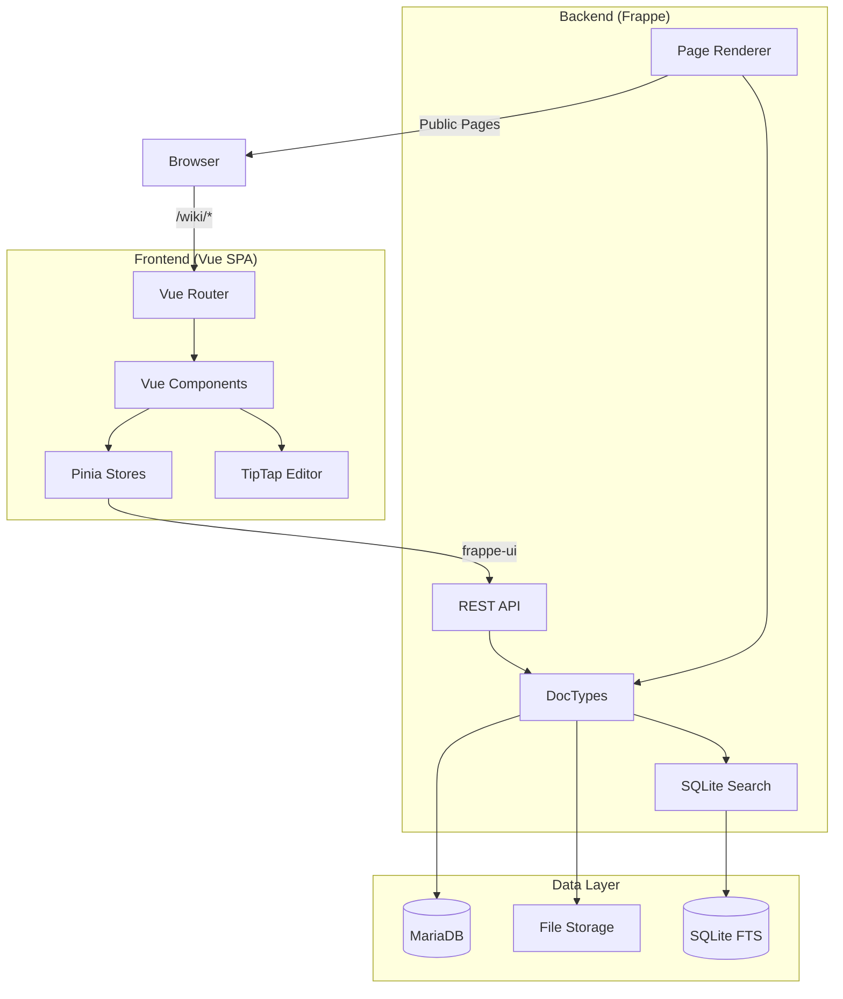

Frappe Wiki is a modern collaborative wiki platform built on the Frappe Framework, featuring a dual-architecture design with a Python backend and Vue.js frontend.

## System Architecture

The application follows a clear separation between backend and frontend:

## Architecture Components

### Backend Application

The backend lives in `wiki/` and is a standard Frappe app written in Python.

**Key Responsibilities:**
- Data model and business logic implementation via DocTypes
- REST API endpoints for CRUD operations
- Public page rendering for published wiki documents
- Search indexing and full-text search
- Permission and access control
- Markdown to HTML conversion

**Technology Stack:**
- **Framework:** Frappe Framework (Python)
- **Database:** MariaDB/MySQL
- **Search:** SQLite FTS (Full-Text Search)
- **Template Engine:** Jinja2

### Frontend Application

The frontend SPA lives in `frontend/` and is built as a modern Vue.js application.

**Key Responsibilities:**
- Interactive document editing and management
- Space and navigation configuration
- Change request workflow UI
- Real-time collaboration features
- Rich text editing with TipTap

**Technology Stack:**
- **Framework:** Vue 3 with Composition API
- **UI Library:** Frappe UI
- **Router:** Vue Router
- **State Management:** Pinia
- **Editor:** TipTap (ProseMirror-based)
- **Build Tool:** Vite

**Build Output:** Compiled assets are shipped to `/assets/wiki/frontend` and loaded by `wiki/www/wiki.html`.

### Page Rendering

Frappe Wiki supports two rendering modes:

#### 1. SPA Mode (Authenticated)

- Entry point: `/wiki` route
- Loaded by `wiki/www/wiki.html` and `wiki/www/wiki.py`
- Provides boot context (CSRF token, site info, timezone)
- Full interactive editing and management interface
- Requires authentication

#### 2. Public Page Mode (Guest Access)

- Rendered by `WikiDocumentRenderer` class
- Uses `templates/wiki/document.html` Jinja template
- Server-side HTML generation from Markdown
- Provides breadcrumbs, table of contents, and navigation
- Supports guest access for published documents

### Data Flow

```mermaid
sequenceDiagram
    participant User
    participant Vue as Vue SPA
    participant API as Frappe API
    participant DB as Database
    
    User->>Vue: Edit document
    Vue->>API: Save changes (frappe-ui)
    API->>DB: Update Wiki Document
    DB-->>API: Confirm
    API->>DB: Create Wiki Revision
    API-->>Vue: Return revision ID
    Vue-->>User: Show success
```

## Key Design Patterns

### Tree-Based Document Organization

Wiki documents use Frappe's NestedSet pattern for hierarchical organization:
- Left/right values (`lft`, `rgt`) for efficient tree queries
- Parent-child relationships via `parent_wiki_document`
- Support for groups (folders) and leaf nodes (pages)

### Content Addressing

Version 3 architecture uses content-addressable storage:
- **Wiki Content Blob:** Immutable content storage with hash-based addressing
- **Wiki Revision:** Snapshot of the entire document tree at a point in time
- **Wiki Revision Item:** Individual document state within a revision

This enables:
- Efficient change tracking
- Deduplication of identical content
- Git-like branching and merging capabilities

### Change Request Workflow

Contributions follow a review workflow:
1. User creates changes in a draft Change Request
2. Changes are tracked in a separate Wiki Revision
3. Reviewers can approve or request changes
4. Approved changes are merged into the main revision
5. Conflicts are detected and can be resolved

## Configuration

The application is configured through:

- **`wiki/hooks.py`:** App-level configuration including page renderer, search backend, and event hooks
- **Wiki Settings DocType:** Global settings for themes, navbar, feedback, and search
- **Wiki Space DocType:** Per-space configuration for branding, navigation, and publishing

## Integration Points

### Frappe Framework Integration

- Uses Frappe's authentication and session management
- Leverages Frappe's permission system with custom roles (Wiki User, Wiki Manager, Wiki Approver)
- Integrates with Frappe Desk for backend administration
- Uses Frappe's file attachment system

### External References

- **User DocType:** Links authors, reviewers, and contributors
- **Top Bar Item DocType:** Configures navigation menus

## Deployment

The application follows Frappe's standard deployment model:

1. Backend app installed via `bench install-app wiki`
2. Frontend built during installation: `cd frontend && npm run build`
3. Compiled assets served from `sites/assets/wiki/frontend/`
4. Application accessible at `/wiki` route on the Frappe site

## Performance Considerations

- **SQLite FTS:** Fast full-text search without external dependencies
- **Content Deduplication:** Hash-based content blobs reduce storage
- **Tree Queries:** NestedSet enables efficient descendant queries
- **Asset Bundling:** Vite optimizes and code-splits frontend assets
- **Socket.io:** Real-time updates for collaborative features
