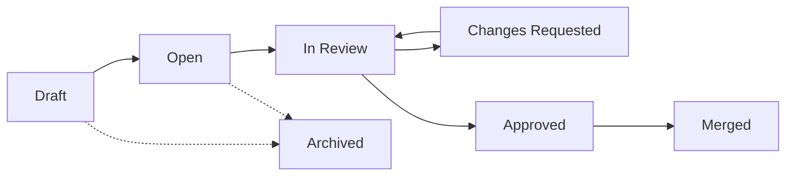

Frappe Wiki uses a change request (CR) workflow similar to pull requests in version control systems. All edits, page creation, reorganization, and deletions go through change requests before being published to the live wiki. This ensures content quality and allows for collaborative review.

## Understanding Change Requests

### What is a Change Request?

A change request is a container for proposed changes to your wiki:

- **Draft Changes**: All edits are saved in a draft CR
- **Review Process**: Changes can be reviewed before publishing
- **Collaboration**: Multiple people can contribute to a CR
- **Version History**: Each CR creates a snapshot of changes

### Change Request Lifecycle



**Status Definitions:**

- **Draft**: Work in progress, not yet ready for review
- **Open**: Ready for review but no reviewers assigned
- **In Review**: Reviewers are evaluating the changes
- **Changes Requested**: Reviewers requested modifications
- **Approved**: All reviewers approved, ready to merge
- **Merged**: Changes published to live wiki
- **Archived**: Closed without merging

## Working with Drafts

### Creating a Draft

A draft change request is created automatically:

<Steps>
  <Step title="Navigate to Your Wiki">
    Open the wiki space where you want to make changes.
  </Step>
  <Step title="Make Changes">
    Click on any page or create new content. Your changes are saved to a draft automatically.
  </Step>
  <Step title="Draft Auto-Creation">
    If you don't have an active draft, the system creates one titled "Draft Changes - [Space Name]".
  </Step>
</Steps>

### Multiple Drafts

**One Draft per User**: Each user has one active draft per wiki space at a time. If you have an existing draft with changes, the system reuses it.

**Stale Drafts**: If your draft becomes outdated (main wiki changed), the system:
- Marks the draft as outdated
- Creates a new draft if the old one has no changes
- Archives empty stale drafts automatically

### Viewing Your Draft

See all changes in your draft:

<Steps>
  <Step title="Access Draft Panel">
    The sidebar shows your draft changes with visual indicators:
    - Blue "New" badge for new pages
    - Blue "Modified" badge for edited pages
    - Red "Deleted" badge for removed pages
    - Orange "Reordered" badge for moved pages
  </Step>
  <Step title="Review Changes">
    Click the **Changes** tab (if available) to see a summary of all modifications.
  </Step>
</Steps>

## Submitting for Review

When your changes are ready:

<Steps>
  <Step title="Complete Your Edits">
    Make sure all pages are saved and you're satisfied with the changes.
  </Step>
  <Step title="Update CR Details">
    Click the change request title at the top and:
    - Add a descriptive title (e.g., "Add API documentation")
    - Write a description explaining what changed and why
  </Step>
  <Step title="Request Review">
    Click **Request Review** and select one or more reviewers from your team.
  </Step>
  <Step title="Submit">
    Click **Submit** to change the status to "In Review" and notify reviewers.
  </Step>
</Steps>

<Note>
Reviewers receive notifications about your change request and can view all modifications.
</Note>

## Reviewing Changes

If you're assigned as a reviewer:

### Viewing Change Requests

<Steps>
  <Step title="Access Change Requests">
    Navigate to the wiki space and open the **Change Requests** view.
  </Step>
  <Step title="Filter CRs">
    Filter by status:
    - **Open**: Unassigned CRs
    - **In Review**: CRs awaiting your review
    - **Approved**: CRs ready to merge
    - **All**: See everything including merged and archived
  </Step>
  <Step title="Open a CR">
    Click on a change request to view its details.
  </Step>
</Steps>

### Reviewing Content

<Tabs>
  <Tab title="Preview Changes">
    <Steps>
      <Step>Navigate through the sidebar to view modified pages</Step>
      <Step>Read the content in the editor view</Step>
      <Step>Check for accuracy, clarity, and completeness</Step>
    </Steps>
  </Tab>
  <Tab title="View Diff">
    <Steps>
      <Step>Click the **Changes** or **Diff** tab</Step>
      <Step>Review the summary of added, modified, and deleted pages</Step>
      <Step>Click individual changes to see detailed differences</Step>
    </Steps>
  </Tab>
  <Tab title="Check Structure">
    <Steps>
      <Step>Verify page organization and hierarchy</Step>
      <Step>Check that routes (URLs) are clean and appropriate</Step>
      <Step>Ensure publish status is correct for each page</Step>
    </Steps>
  </Tab>
</Tabs>

### Providing Feedback

<Steps>
  <Step title="Review Thoroughly">
    Read all changes and verify:
    - Content accuracy and quality
    - Formatting and markdown correctness
    - Links work properly
    - Images and media load correctly
    - Organization makes sense
  </Step>
  <Step title="Submit Review">
    Click **Submit Review** and choose:
    - **Approve**: Changes are good to merge
    - **Request Changes**: Modifications needed
  </Step>
  <Step title="Add Comments">
    Write specific feedback:
    - What needs to change
    - Suggestions for improvement
    - Questions about content
  </Step>
  <Step title="Submit">
    Click **Submit** to send your review to the author.
  </Step>
</Steps>

<Info>
Multiple reviewers can be assigned. All must approve before the CR can be merged.
</Info>

## Responding to Review Feedback

If reviewers request changes:

<Steps>
  <Step title="View Feedback">
    Open your change request to see reviewer comments and requested changes.
  </Step>
  <Step title="Make Updates">
    Edit pages directly in the CR to address feedback:
    - Fix issues mentioned in comments
    - Make suggested improvements
    - Add clarifications
  </Step>
  <Step title="Request Re-Review">
    After making changes, click **Request Review** again to notify reviewers that you've addressed their feedback.
  </Step>
</Steps>

## Merging Changes

Once approved, changes can be published:

### Who Can Merge?

Only users with the following roles can merge change requests:
- **Wiki Manager**: Full control over wiki content
- **Wiki Approver**: Can approve and merge changes
- **System Manager**: Administrative access

### Merging Process

<Steps>
  <Step title="Verify Approval">
    Ensure the CR status is **Approved** with all required approvals.
  </Step>
  <Step title="Click Merge">
    Click the **Merge** button in the CR header.
  </Step>
  <Step title="Confirm">
    Review the merge summary and confirm the action.
  </Step>
  <Step title="Changes Go Live">
    All changes are immediately published to the live wiki.
  </Step>
</Steps>

<Warning>
Merging publishes changes immediately. Ensure all content is final before merging.
</Warning>

### Merge Strategies

**Fast-Forward Merge**

When no one else has modified the wiki since you started:
- Your changes apply directly
- No conflicts possible
- Fastest and simplest merge

**Three-Way Merge**

When the main wiki has changed since you started:
- System attempts automatic merge
- Non-overlapping changes merge cleanly
- Conflicts may require resolution

## Handling Merge Conflicts

If your changes conflict with recent updates:

### Understanding Conflicts

Conflicts occur when:
- Same page edited in your CR and in main wiki
- Pages moved to different locations in both places
- Same page deleted in one place, edited in the other

### Conflict Types

| Type | Description |
|------|-------------|
| **Content** | Same content edited differently |
| **Tree** | Page moved to different parent or position |
| **Meta** | Title, route, or settings changed differently |

### Resolving Conflicts

<Steps>
  <Step title="View Conflicts">
    When a merge fails, the system displays all conflicts with details.
  </Step>
  <Step title="Choose Resolution">
    For each conflict, select:
    - **Ours**: Keep the version from main wiki
    - **Theirs**: Use your CR version
  </Step>
  <Step title="Review Choice">
    See a preview of both versions to make an informed decision.
  </Step>
  <Step title="Resolve All">
    Work through all conflicts one by one.
  </Step>
  <Step title="Retry Merge">
    Click **Retry Merge** to apply your resolutions and complete the merge.
  </Step>
</Steps>

<Info>
Conflict resolution requires the Wiki Manager or Wiki Approver role.
</Info>

## Change Request Features

### Outdated Detection

The system tracks if your draft is based on an outdated version:

- **Outdated Badge**: Shows when main wiki has changed
- **No Auto-Update**: Your draft stays as-is (prevents lost work)
- **Merge Required**: Conflicts resolved during merge, not during editing

### Change Summary

View a complete summary of all changes:

- **Added**: New pages created
- **Modified**: Existing pages edited
- **Deleted**: Pages removed
- **Reordered**: Pages moved to new positions or parents

### Participants

Track everyone involved:
- **Author**: Person who created the CR
- **Contributors**: Anyone who made edits
- **Reviewers**: People assigned to review
- **Merger**: Person who merged the CR

## Best Practices

<AccordionGroup>
  <Accordion title="Write Clear Titles and Descriptions">
    Help reviewers understand what changed and why with descriptive CR titles and detailed descriptions.
  </Accordion>
  <Accordion title="Make Focused Changes">
    Keep change requests focused on a single topic or feature. Break large changes into multiple CRs.
  </Accordion>
  <Accordion title="Review Promptly">
    Respond to review requests quickly to avoid blocking other contributors.
  </Accordion>
  <Accordion title="Test Before Requesting Review">
    Verify all links work, images load, and content displays correctly before requesting review.
  </Accordion>
  <Accordion title="Communicate with Team">
    Use CR comments to discuss changes, ask questions, and provide context.
  </Accordion>
  <Accordion title="Merge Regularly">
    Merge approved changes promptly to reduce conflicts and keep the wiki up-to-date.
  </Accordion>
  <Accordion title="Handle Conflicts Carefully">
    Take time to understand conflicts and choose the correct resolution to avoid data loss.
  </Accordion>
</AccordionGroup>

## Managing Change Requests

### Editing CR Details

Update the title and description:

1. Click the CR title at the top of the page
2. Edit the title field
3. Update the description with additional context
4. Changes save automatically

### Archiving CRs

Close a CR without merging:

<Steps>
  <Step title="Open CR Menu">
    Click the three-dot menu in the CR header.
  </Step>
  <Step title="Select Archive">
    Choose **Archive** from the menu.
  </Step>
  <Step title="Confirm">
    Confirm that you want to close the CR without merging.
  </Step>
</Steps>

<Warning>
Archived CRs cannot be reopened. The changes are not lost but you'll need to create a new CR to apply them.
</Warning>

### Viewing Merged CRs

See the history of merged changes:

1. Go to the Change Requests view
2. Filter by **Merged** status
3. Click any merged CR to see:
   - What changed
   - When it was merged
   - Who merged it
   - Review history

## Common Workflows

### Solo Editing

```
1. Make changes in your draft
2. Review your own work
3. Merge directly (if you have permission)
```

### Team Review

```
1. Author makes changes
2. Author requests review from team member(s)
3. Reviewers provide feedback
4. Author addresses feedback
5. Reviewers approve
6. Manager/Approver merges
```

### Collaborative Editing

```
1. Team member A creates draft
2. Team member B adds to the same draft
3. Team member C reviews
4. Merge when approved
```

<Note>
Multiple people can contribute to the same CR by switching to it in the space selector.
</Note>

## Next Steps

<CardGroup cols={2}>
  <Card title="Publishing" icon="rocket" href="/guides/publishing">
    Learn about publishing settings and visibility control
  </Card>
  <Card title="Creating Content" icon="pen" href="/guides/creating-content">
    Return to the content creation guide
  </Card>
</CardGroup>